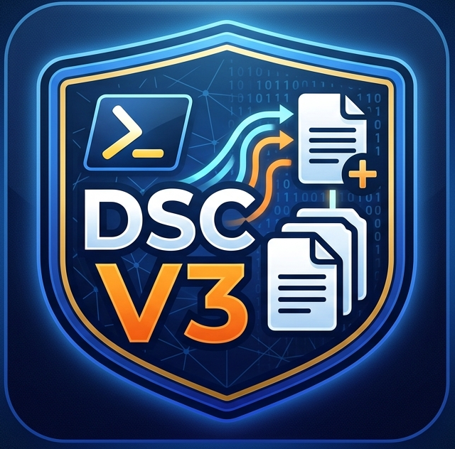

# DSC-DocsGenerator


Generate Markdown compliance reports from DSC v3 configuration test results.



This module runs `dsc config test` for a YAML configuration file, parses the output, and creates a report that includes:

- Configuration summary (OS, hostname, file, run time, document version)
- Resource overview table with compliance status
- Detailed desired vs actual state for each resource

## What This Module Exports

The module exports one public function:

- `Invoke-DSCDrifftDocs`

> Note: The command name includes `Drifft` (double `f`) and must be typed exactly as shown.

## Prerequisites

- PowerShell 5.1 or PowerShell 7+
- DSC v3 installed and available in PATH (`dsc --version` works)
- Required DSC resources installed for the target config

## Install and Import

### Option 1: Import directly from this repo

```powershell
Import-Module .\module\DSC-DocsGenerator\DSC-DocsGenerator.psd1 -Force
Get-Command -Module DSC-DocsGenerator
```

### Option 2: Copy to your modules path

Copy the folder `module\DSC-DocsGenerator` to one of the paths in `$env:PSModulePath`, then:

```powershell
Import-Module DSC-DocsGenerator -Force
```

### Option 3: Install from PowerShell Gallery

```powershell
Install-Module -Name DSC-DocsGenerator
Import-Module DSC-DocsGenerator -Force
```

## Quick Start

From the repository root:

```powershell
Import-Module .\module\DSC-DocsGenerator\DSC-DocsGenerator.psd1 -Force

Invoke-DSCDrifftDocs `
	-ConfigFile .\dsc-config\CIS-w2025-Level1-MemberServer.registry.dsc.yaml
```

If `-OutputFile` is not provided, a timestamped Markdown file is created next to the config file.

## Command Syntax

```powershell
Invoke-DSCDrifftDocs `
	-ConfigFile <string> `
	[-OutputFile <string>] `
	[-DocumentVersion <string>] `
	[-ReportTitle <string>] `
	[-PassThru] `
	[-WhatIf] [-Confirm] [-Verbose]
```

## Parameters

| Parameter | Required | Description |
|---|---|---|
| `ConfigFile` | Yes | Path to a DSC YAML configuration file. |
| `OutputFile` | No | Target Markdown file path. If omitted, auto-generates a timestamped file in the config folder. |
| `DocumentVersion` | No | Version label written into the report. Default: `1.0`. |
| `ReportTitle` | No | Report heading (H1). Default: `DSC Configuration Report`. |
| `PassThru` | No | Returns the generated Markdown content as a string. |

## Usage Examples

### 1) Generate report with default output name

```powershell
Invoke-DSCDrifftDocs `
	-ConfigFile .\dsc-config\CIS-w2025-Level1-MemberServer.securitypolicy.dsc.yaml
```

### 2) Generate report with custom title, version, and output path

```powershell
Invoke-DSCDrifftDocs `
	-ConfigFile .\dsc-config\CIS-w2025-Level1-MemberServer.registry.dsc.yaml `
	-OutputFile .\report-example\registry-report.md `
	-ReportTitle "CIS Windows Server 2025 - Registry Compliance" `
	-DocumentVersion "2.0"
```

### 3) Capture generated Markdown in memory

```powershell
$markdown = Invoke-DSCDrifftDocs `
	-ConfigFile .\dsc-config\CIS-w2025-Level1-MemberServer.registry.dsc.yaml `
	-PassThru

$markdown.Length
```

### 4) Preview actions without writing files

```powershell
Invoke-DSCDrifftDocs `
	-ConfigFile .\dsc-config\CIS-w2025-Level1-MemberServer.registry.dsc.yaml `
	-WhatIf
```

### 5) Run with diagnostics

```powershell
Invoke-DSCDrifftDocs `
	-ConfigFile .\dsc-config\CIS-w2025-Level1-MemberServer.registry.dsc.yaml `
	-Verbose
```

## How Invocation Works Internally

When you invoke `Invoke-DSCDrifftDocs`, the module performs these actions:

1. Verifies the `dsc` CLI is installed.
2. Reads the config file and checks whether referenced resource types are available.
3. Runs `dsc config test --file <ConfigFile>`.
4. Parses JSON output returned by DSC.
5. Builds a Markdown report with summary, overview, and per-resource details.
6. Writes the report file (unless blocked by `-WhatIf`).

## Troubleshooting

### `dsc` not found

Install DSC v3 and ensure it is in PATH. Verify with:

```powershell
dsc --version
```

### Missing DSC resources

If the command reports missing resources, install the resource modules required by your YAML config and run again.

### No report written

Check whether `-WhatIf` was used, and verify output folder permissions.

## Output Location and Samples

- Input sample configs: `dsc-config\`
- Example generated reports: `report-example\`

